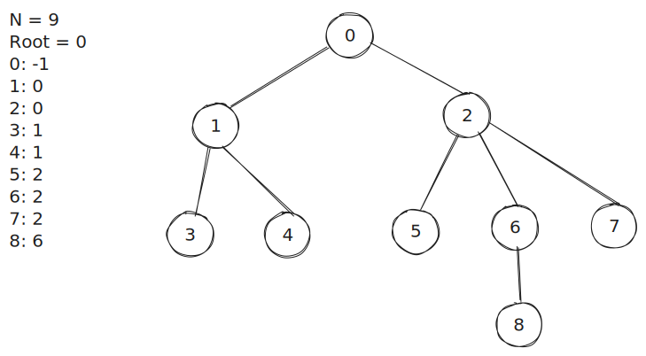

# Trees

## Хранение в файле

Дерево храниться в файле в виде списка из номера вершины и ее родителя `:`.

Структура:
```
N = {количество узлов}
Root = {корневой узел}
{номер узла}: {номер родительского узла}
{номер узла}: {номер родительского узла}
{номер узла}: {номер родительского узла}
...
```

Пример:


## Хранение в памяти

В памяти дерево храниться в виде объекта с интерфейсом:

```ts
export interface IGraph {
    nodesCount: number;
    rootNode: number;
    nodes: Array<GraphNeighboringVertices>;
}
```
, где
```ts
type GraphNeighboringVertices = Array<number>;
```

В поле `nodes` хранятся все соседние узлы, выключая родительский.
